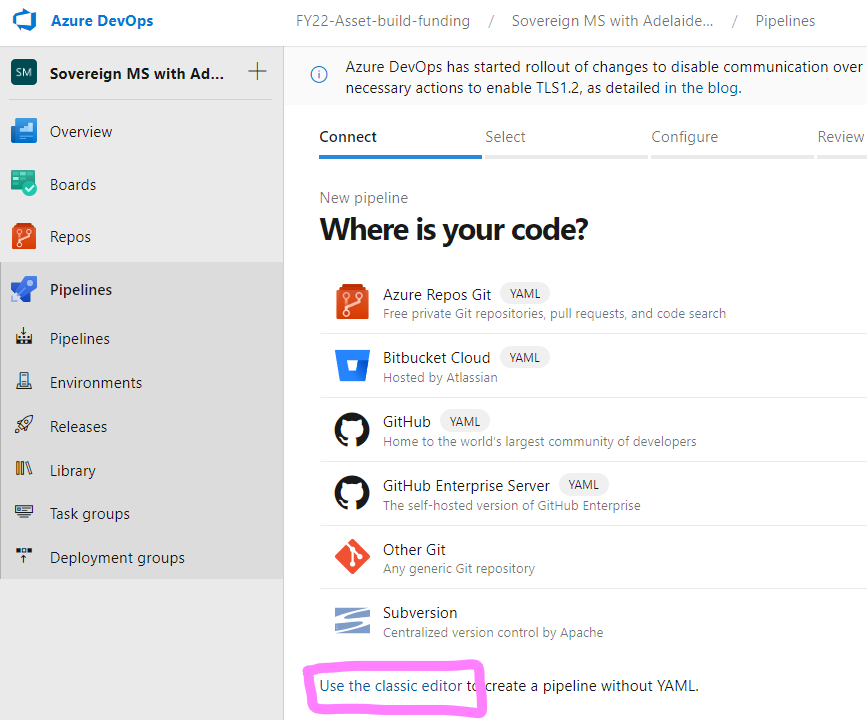
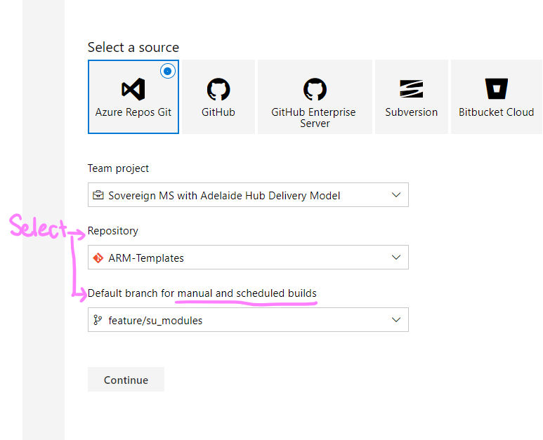
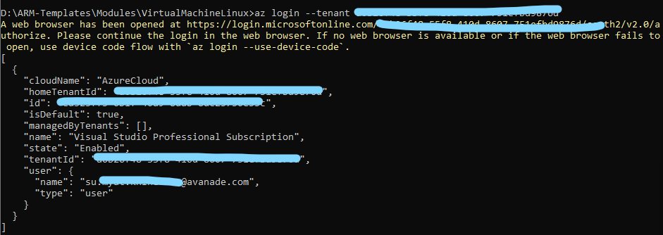
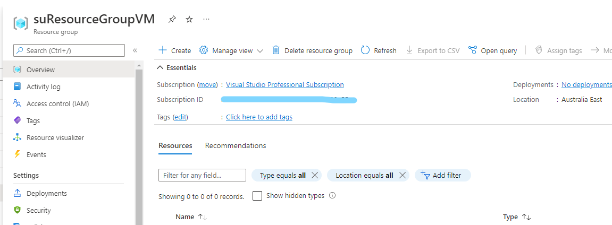
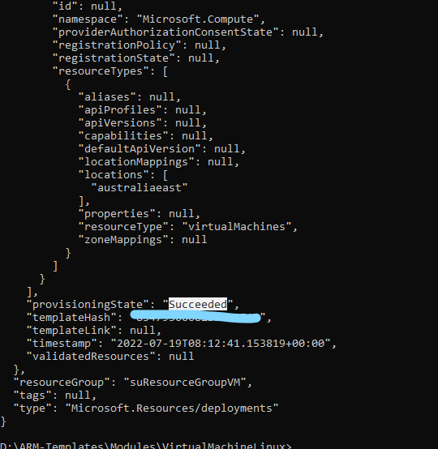
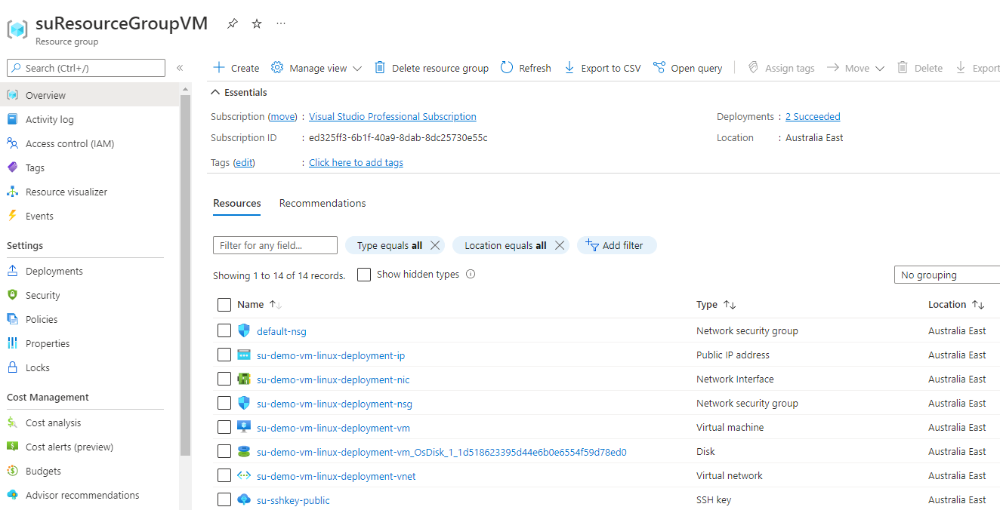
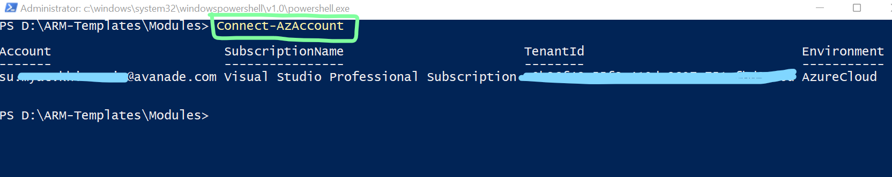
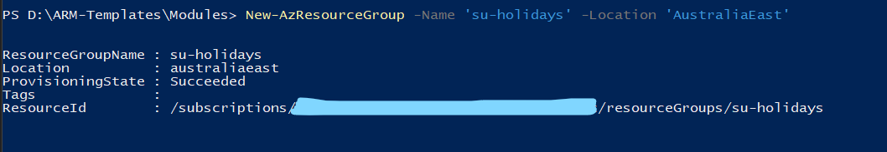
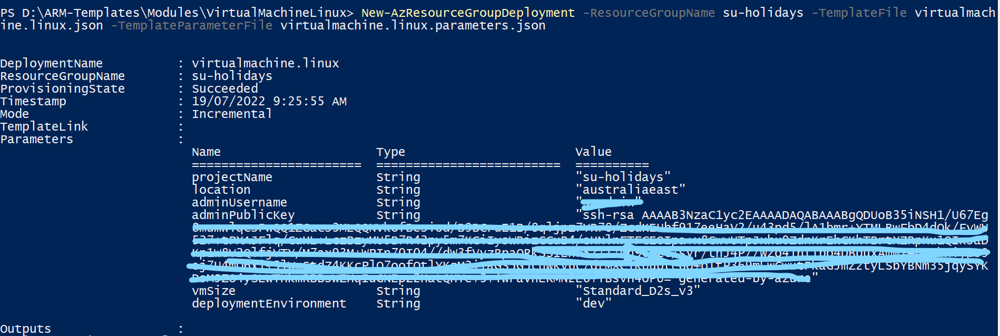

# Deployment 
The document outlines the deployment of a linux virtual machine via both Azure cli and Azure Powershell.

    ```
    Table of Contents 
        1. Deployment Example via Classic
        2. Deployment Example with YAML 
        3. Deployment Example via cli
        4. Deployment Example via Powershell
    ```

---
## 2. CI Example via Classic
- Install [AzureDevOps Extensions](https://docs.microsoft.com/en-us/azure/devops/marketplace/install-extension?view=azure-devops&tabs=browser)
- Go to the pipeline -> Create -> Use classic editor 
    - 
- Select the repo and branch name. This branch will be used for manual trigger.
    - 
- 
---
## 2. [CI Example with YAML](https://arnav.au/2022/07/05/authoring-azure-devops-pipelines/) 
- Go to the pipeline -> Create -> 
---
## 3. CD with example classic 
- Needs to set up environment e.g. Dev, QA, Prod (staging slot, production slot)
- AzureDevOps to the Environment in the portal connection 

---
## 3. Deployment Example via cli 
- [Refer the this list for cli commands](https://docs.microsoft.com/en-us/cli/azure/reference-index?view=azure-cli-latest)
- [Download Azure cli](https://azcliprod.blob.core.windows.net/msi/azure-cli-2.38.0.msi)
    - For doc, go to [this link](https://docs.microsoft.com/en-us/cli/azure/install-azure-cli-windows?tabs=azure-cli).
    - For video instruction, go to this [video](https://www.youtube.com/watch?v=tD-ixw8szIQ), only Azure cli installation part.
- After you download, you need to log in.
    ```
        az login --tenant addIDnumberToHere
    ```
    - 
- To get regions name, [this link](https://azuretracks.com/2021/04/current-azure-region-names-reference/) is checked.
- For deploying the virtualmachine.linux.json ARM template via cli, read the following resources and the detailed steps are outlined below.
    - [How to use Azure Resource Manager (ARM) deployment templates with Azure CLI](https://docs.microsoft.com/en-us/azure/azure-resource-manager/templates/deploy-cli)
- **Detailed steps**
    - Deploy resource group 

        ```
        az group create --name suResourceGroupVM --location australiaeast
        ```
    - Confirm this resource via the portal. You should also see `"provisioningState" : "Succeeded"`
        - 

    - In the parameters, value for adminPublicKey is required. 

    ```
        "adminPublicKey": {
            "value": "" 
        },
    ```
    - To get the SSH Key pair, use this command.

    ```
        ssh-keygen -m PEM -t rsa -b 4096
    ```
    - Add public SHH key into adminPublicKey value in the virtualmachine.linux.parameters.json file.
    - To deploy the resource, use the below command.
        - cd into the folder
    ```
        az deployment group create -g suResourceGroupVM --template-file virtualmachine.linux.json --parameters @virtualmachine.linux.parameters.json
    ```
- You should get *Succeeded* in the provisioningState in your cli.
    - 
- Go to the portal and check for all the resources deployed.
    - 
- To log out , follow the below command. It will log you out and remove access to Azure subscriptions.

    ```
        az logout	
    ```
---

## 4. Deployment Example via Powershell

- [Download Azure powershell](https://docs.microsoft.com/en-us/powershell/scripting/install/installing-powershell-on-windows?view=powershell-7.2)
- After you download, you need to log in.
    ```
        Connect-AzAccount
    ```
    - 
- To get regions name, [this link](https://azuretracks.com/2021/04/current-azure-region-names-reference/) is checked.

- **Detailed steps**
    - [Deploy resource group](https://docs.microsoft.com/en-us/powershell/module/az.resources/new-azresourcegroup?view=azps-8.1.0) 

        ```
        New-AzResourceGroup -Name su-holidays -Location "AustraliaEast"
        ```
    - You should also see `"provisioningState" : "Succeeded"`
        - 

    - In the parameters, value for adminPublicKey is required. 

    ```
        "adminPublicKey": {
            "value": "" 
        },
    ```
    - To get the SSH Key pair, use this command.

    ```
        ssh-keygen -m PEM -t rsa -b 4096
    ```
    - Add public SHH key into adminPublicKey value in the virtualmachine.linux.parameters.json file.
    - To deploy the resource, use the below command.
        - cd into the folder
    ```
    New-AzResourceGroupDeployment -ResourceGroupName su-holidays -TemplateFile virtualmachine.linux.json -TemplateParameterFile virtualmachine.linux.parameters.json
    ```
- You should get *Succeeded* in the provisioningState in your cli.
    - 
- Go to the portal and check for all the resources deployed.
    - 
- To [log out](https://docs.microsoft.com/en-us/powershell/module/az.accounts/disconnect-azaccount?view=azps-8.1.0) , follow the below command. It will log you out and remove access to Azure subscriptions.

    ```
        Disconnect-AzAccount	
    ```

---
## Concepts 
- In OOP concept, pipeline is like a Class, run is like an object. Pipeline execution is run.

    ``` 
        class Pipeline {

        }

        Pipeline run = new Pipeline();

    ```
- Agent - Where are the steps going to be executed? The machine/software listens to the instructions from pipeline and execute the instructions.
    - Two types
        - Microsoft hosted agent
        - Self-hosted agent 
- Build artifact : is the final product of the build pipeline 

- https://my.visualstudio.com => Click on Azure subscription
- New window
- log in with your outlook account