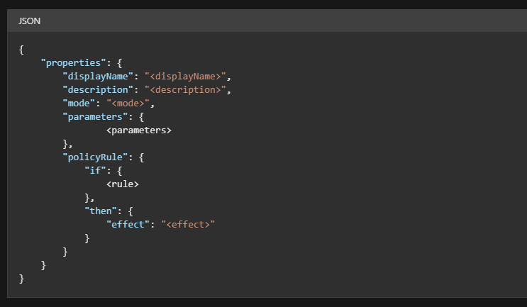
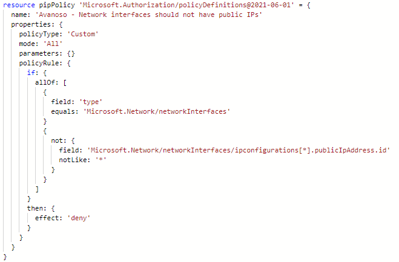

# Introduction 
This template will deploy Policies with the `targetScope` as `managementGrop`. 

Azure Policy establishes conventions for resources. Policy definitions describe resource compliance conditions and the effect to take if a condition is met. A condition compares a resource property field or a value to a required value. Resource property fields are accessed by using aliases. When a resource property field is an array, a special array alias can be used to select values from all array members and apply a condition to each one. Learn more about conditions.

By defining conventions, you can control costs and more easily manage your resources. For example, you can specify that only certain types of virtual machines are allowed. Or, you can require that resources have a particular tag. Policy assignments are inherited by child resources. If a policy assignment is applied to a resource group, it's applicable to all the resources in that resource group

As an example, Policy can be defined to `allow Azure resources only in AustraliaEast and AustraliaSouthEast locations`

More details about Azure Policy Definitions can be referred [here](https://docs.microsoft.com/en-us/azure/governance/policy/concepts/definition-structure)

## Version
| Version | Date | Release Notes | Author
|---|---|---|---|
| 1.0.0 | Aug22 | First release | Rama Balla

## Developed On
| Module Version | AzureRM Version |
|---|---|
| 1.0.0 | |

## Module Dependencies
- None

### Policy Definitions can be defined like below 
- Policy Definition Structure sample

- Policy Definition Structure code

## Required Parameters
| Parameter Name | Description |  Type | 
|---|---|---|
|policyDefinitionObject | The object that contains several policyDefinitions | Object |
|location | Location where the resources get deployed | string
|targetScope |Applicate Scope Level | string
|policyType | Type of the Policy Definition `Custom or Built-in` | string

## Optional/Advance Parameters
- There are no advance or optional Parameters.

## Outputs
- There are no outputs.

## Additional details
- None

## References
- [Create a Custom Policy Definition](https://docs.microsoft.com/en-us/azure/governance/policy/tutorials/create-custom-policy-definition)
- [Azure Policy with AzDevOps](https://docs.microsoft.com/en-us/azure/governance/policy/tutorials/policy-devops-pipelines)
- [Assign Policy as Code with GitHub](https://docs.microsoft.com/en-us/azure/governance/policy/tutorials/policy-as-code-github)
- [Assign Policy through Azure Portal](https://docs.microsoft.com/en-us/learn/modules/build-cloud-governance-strategy-azure/6-control-audit-resources-azure-policy)

